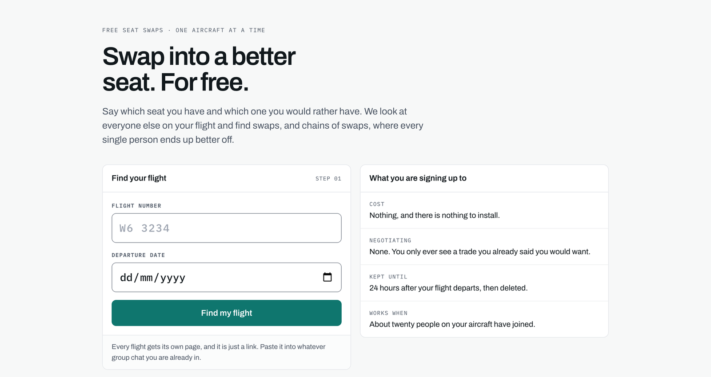
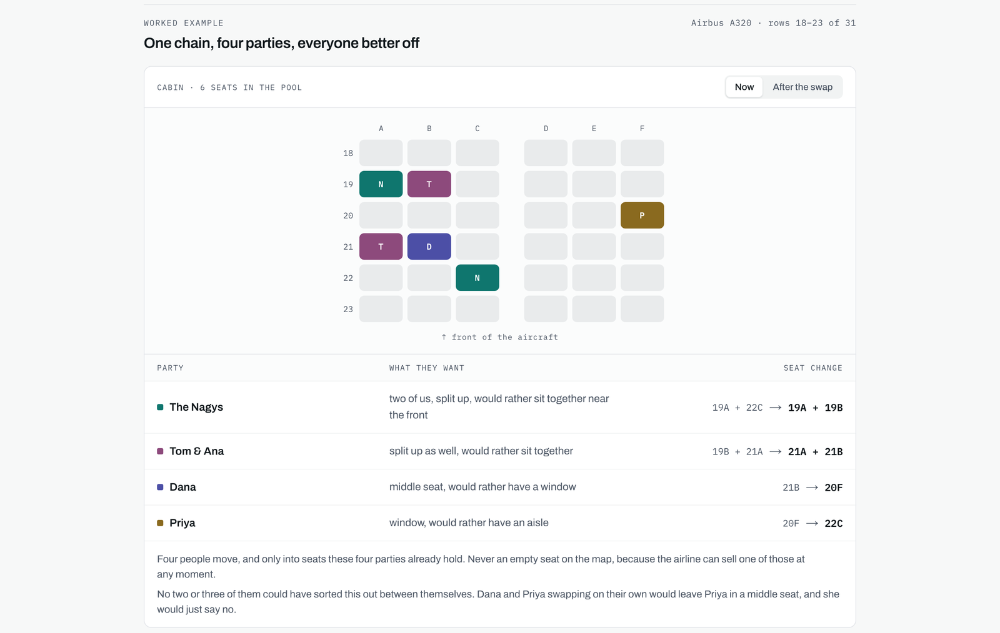

  

<h1 align="center">seatswap</h1>

  <strong>Swap into a better seat. For free.</strong> 
  Seat swaps between passengers on the same flight, agreed before anyone boards.

  <a href="#how-it-works">How it works</a> &middot;
  <a href="docs/how-it-works.md">Under the hood</a> &middot;
  <a href="docs/liquidity.md">Simulation report</a>

 

## The problem

Airlines split groups up and charge to fix it. On board, that turns into a
stranger being asked to give up their seat for nothing in return.

## The idea

Groups want to sit together. Solo travellers want a window or an aisle. Those
wants barely overlap, so a group can trade away seat quality it does not care
about for the adjacency it does. Everyone gets something they wanted, and nobody
has to ask anyone for a favour.

## How it works

| | |
|---|---|
| **1. Join your flight** | Weeks ahead, open your flight's page, sign in with Telegram and answer three quick questions. |
| **2. Send your seat** | When check-in opens, the bot asks for it. Reply `14A`, or scan your boarding pass. |
| **3. Get matched** | seatswap looks at the whole flight and sends you a swap. Accept with one tap. |
| **4. Swap on board** | Everyone in the swap gets the same agreement page. Show it and change seats. |

## Chains, not just swaps

The best swaps rarely happen between two people. Here four parties each get what
they asked for, and no two or three of them could have arranged it on their own.
seatswap finds these chains across the entire flight.

## Why it is different

- **Free, with nothing to install.** Every flight has its own link that works in
  any browser and any group chat.
- **No negotiating.** You only see trades you already said you would want, and
  nobody ever ends up worse off.
- **Built to be accepted.** A swap involves at most four parties, which makes a
  yes from everyone far more likely.
- **Private by design.** No phone numbers, no full names. Boarding passes are read
  in your browser, and all personal data is deleted 24 hours after departure.

## By the numbers

From 800 simulated flights:

| | |
|---|---|
| **2.8x** | more groups seated together than with two-person swaps alone, at 10% participation |
| **~20** | passengers on one flight is all it takes to start working |
| **< 1.4 s** | to solve a flight with 59 seats in play |
| **0** | favours asked |

The full method and results are in the [simulation report](docs/liquidity.md).

## Built with

Next.js, React, TypeScript and Tailwind CSS on the web. A Python worker running
Google OR-Tools CP-SAT does the matching. PostgreSQL stores everything and doubles
as the job queue, and Telegram handles sign-in and notifications.

Curious how the matching works? Read [Under the hood](docs/how-it-works.md).

## Status

- [x] Matching engine and flight simulator
- [x] Flight pages, Telegram sign-in and bot
- [x] Boarding pass scanning and verification
- [x] 439 automated tests
- [ ] Public launch

## License

Copyright (c) 2026 Gabriel Niculaesei. All rights reserved.

The code is public to read, not to reuse. See [LICENSE](LICENSE).
