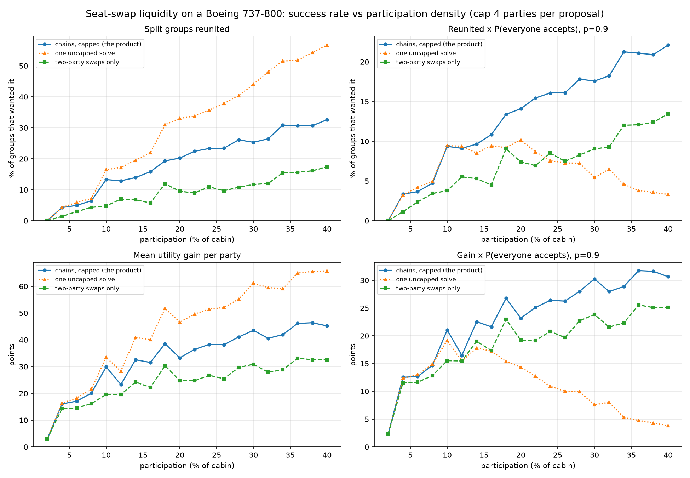

# Liquidity: how much participation does this need?

> Generated by `solver/simulator.py`. The numbers below come from 40 synthetic
> flights per participation level, 20 levels, 2 % to 40 % of the cabin — 800
> flights, about 16 minutes of CPU. Re-run with:
> ```bash
> cd solver
> python simulator.py --flights 40 --participation 0.02:0.40:0.02 --cap 4 \
>     --out ../docs/liquidity.png --json ../docs/liquidity.json \
>     --markdown ../docs/liquidity-tables.md   # regenerates the tables below
> ```

Everything below comes from synthetic flights, not from users. That is the point:
the solver is the part of this product that either works or does not, and it can
be proven out before a single person signs up. What the simulator buys is an
honest, numeric answer to the cold-start question — *below what participation
rate is this pointless?* — instead of a hopeful one.

## What is being simulated

A Boeing 737-800 (198 seats, 33 rows of ABC|DEF). For each flight:

- party sizes are drawn 60 % solo / 25 % couples / 15 % groups of three to five;
- seats are drawn uniformly at random from the whole cabin, which is exactly what
  splits groups up in the first place;
- preferences are drawn the way the real questionnaire fills them in — a solo
  traveller picks window (40 %), aisle (35 %) or either (25 %), and a group says
  sitting together is essential (65 %), preferable (25 %) or not important (10 %).

`MIN_GAIN = 20`, so a party has to gain at least a third of a window seat's worth
before it is worth asking it to move at all.

## The baseline

The dashed line in every chart is **two-party swaps only**: greedy, repeated,
mutually-improving single-seat exchanges between two passengers, obeying exactly
the same rules the solver obeys (nobody worse off, everyone who moves gains at
least `MIN_GAIN`). It runs to exhaustion, so it is a strong version of the
manual alternative rather than a strawman.

It is the honest "what could you do without us" comparison: you can ask one
person to trade one seat. The gap between the solid and dashed lines is the value
the chain-finding actually adds.

## The three strategies

| | what it is |
|---|---|
| **chains, capped** | what the product does: at most 4 parties per proposal, solved in rounds, several independent proposals per flight |
| **one uncapped solve** | maximise total welfare in a single solve, as the model was first designed |
| **two-party swaps only** | the baseline: what you could arrange yourself by asking one person |

## The catch that makes the headline number misleading

A proposal is **atomic** — every party in a cycle has to accept or nothing happens.
So "groups reunited" measures what the solver *found*, not what it *delivers*. The
tables below therefore report both, the second multiplied by the probability that
everybody in the cycle actually says yes, assuming 90 % per party.

That assumption is a guess and is flagged as one. The ranking between strategies
does not depend on its value, only on it being below 1.



## Results

| participation | parties | reunited (chains, cap 4) | × P(accept) | reunited (uncapped) | × P(accept) | reunited (pairwise) | mean cycle | proposals/flight |
|---|---|---|---|---|---|---|---|---|
| 2 % | 3 | 0.0 % | **0.0 %** | 0.0 % | 0.0 % | 0.0 % | 2.0 | 0.1 |
| 4 % | 5 | 4.3 % | **3.3 %** | 4.3 % | 3.2 % | 1.4 % | 2.3 | 0.5 |
| 6 % | 8 | 5.0 % | **3.7 %** | 5.9 % | 4.2 % | 3.0 % | 2.8 | 0.7 |
| 8 % | 10 | 6.5 % | **4.7 %** | 7.2 % | 5.0 % | 4.3 % | 3.0 | 1.0 |
| 10 % | 12 | 13.3 % | **9.4 %** | 16.5 % | 9.4 % | 4.8 % | 3.2 | 1.4 |
| 12 % | 16 | 12.9 % | **9.1 %** | 17.2 % | 9.4 % | 7.0 % | 3.1 | 1.4 |
| 14 % | 17 | 13.9 % | **9.7 %** | 19.5 % | 8.5 % | 6.8 % | 3.4 | 1.9 |
| 16 % | 20 | 15.8 % | **10.8 %** | 21.9 % | 9.4 % | 5.8 % | 3.5 | 2.0 |
| 18 % | 22 | 19.3 % | **13.4 %** | 31.0 % | 9.2 % | 12.0 % | 3.4 | 2.6 |
| 20 % | 25 | 20.2 % | **14.1 %** | 33.0 % | 10.2 % | 9.5 % | 3.4 | 2.6 |
| 22 % | 27 | 22.4 % | **15.5 %** | 33.8 % | 8.7 % | 9.0 % | 3.5 | 2.9 |
| 24 % | 30 | 23.3 % | **16.1 %** | 35.7 % | 7.6 % | 11.0 % | 3.5 | 3.3 |
| 26 % | 32 | 23.4 % | **16.1 %** | 37.8 % | 7.3 % | 9.7 % | 3.5 | 3.5 |
| 28 % | 34 | 26.1 % | **17.8 %** | 40.3 % | 7.3 % | 10.8 % | 3.6 | 3.9 |
| 30 % | 35 | 25.3 % | **17.6 %** | 44.0 % | 5.5 % | 11.7 % | 3.5 | 4.4 |
| 32 % | 38 | 26.4 % | **18.2 %** | 48.1 % | 6.5 % | 12.0 % | 3.5 | 4.4 |
| 34 % | 42 | 30.9 % | **21.3 %** | 51.5 % | 4.6 % | 15.5 % | 3.5 | 4.9 |
| 36 % | 43 | 30.6 % | **21.1 %** | 51.8 % | 3.8 % | 15.6 % | 3.5 | 5.5 |
| 38 % | 46 | 30.7 % | **20.9 %** | 54.3 % | 3.6 % | 16.1 % | 3.6 | 5.5 |
| 40 % | 48 | 32.6 % | **22.1 %** | 56.7 % | 3.3 % | 17.4 % | 3.7 | 5.5 |

### Solver cost

| participation | seats in the pool | p95 solve time (capped rounds) | longest cycle seen, uncapped |
|---|---|---|---|
| 2 % | 4 | 0.004 s | 2 parties |
| 4 % | 8 | 0.010 s | 5 parties |
| 6 % | 12 | 0.051 s | 7 parties |
| 8 % | 16 | 0.061 s | 7 parties |
| 10 % | 20 | 0.078 s | 9 parties |
| 12 % | 24 | 0.123 s | 9 parties |
| 14 % | 28 | 0.142 s | 14 parties |
| 16 % | 32 | 0.196 s | 16 parties |
| 18 % | 36 | 0.267 s | 20 parties |
| 20 % | 40 | 0.393 s | 19 parties |
| 22 % | 44 | 0.563 s | 22 parties |
| 24 % | 48 | 0.543 s | 24 parties |
| 26 % | 51 | 0.803 s | 25 parties |
| 28 % | 55 | 0.944 s | 26 parties |
| 30 % | 59 | 1.326 s | 29 parties |
| 32 % | 63 | 1.714 s | 32 parties |
| 34 % | 67 | 2.149 s | 31 parties |
| 36 % | 71 | 3.147 s | 32 parties |
| 38 % | 75 | 2.715 s | 35 parties |
| 40 % | 79 | 5.257 s | 37 parties |


## Reading the result

**1. Below about 8 % of the cabin, this does not work.** At 4 % participation —
eight passengers on a 737-800 — 3 % of the groups that wanted to sit together get
to. There is simply nobody to trade with. The number to aim at is **10 % of a
cabin, roughly 20 passengers or a dozen parties**, where reunification jumps to
13 % and the mean gain per party roughly doubles. That is the real cold-start
threshold, and it is a per-flight threshold, not a per-city or per-country one:
a thousand users spread across Europe are worth nothing, twenty on one flight are
worth everything.

**2. Maximising total welfare makes the product worse the more popular it gets.**
This is the result that changed the design. The uncapped solve reunites far more
groups on paper — 56.7 % against 32.6 % at 40 % participation — and it is the
better strategy right up until you ask how many people have to agree. Its mean
cycle grows from 5 parties at 10 % participation to **28.6 parties at 40 %**, and
the probability that all of them accept collapses faster than the gains grow:

| participation | uncapped: found | uncapped: delivered | capped: delivered |
|---|---|---|---|
| 10 % | 16.5 % | 9.4 % | 9.4 % |
| 20 % | 33.0 % | 10.2 % | 14.1 % |
| 40 % | 56.7 % | **3.3 %** | **22.1 %** |

The uncapped line *peaks around 10 % participation and then falls*. Capping the
proposal size at four parties turns a strategy that degrades with success into one
that improves with it. It costs about a third of the paper utility.

**3. Chains are the product, and the baseline proves it.** Two-party swaps — the
strongest version of "just ask your neighbour" — reunite 4.8 % of groups at 10 %
participation against 13.3 % for the capped solver, and are beaten across the whole
range. Since the baseline only ever produces 2-cycles it enjoys the best possible
acceptance odds, and still loses. The gap is not an artefact of the atomicity
assumption; it is the value of finding rotations.

**4. Solver cost is not a constraint.** Up to 30 % participation (59 seats in the
pool) the p95 solve time is under 1.4 seconds. It reaches 5.3 seconds at 40 %,
still inside the 10-second cap, and CP-SAT is anytime — a run that hits the cap
returns the best solution it has rather than nothing.

One thing worth knowing for anyone re-running this: CP-SAT's **parallel portfolio
is load-bearing here**. With `num_search_workers = 1` a 30-seat instance can burn
30 seconds failing to prove optimality on a problem the 8-worker portfolio closes
in 60 milliseconds. The default is 8 and should stay there.

## What this does not model

- Real acceptance behaviour. 90 % per party is an assumption, not a measurement.
- Correlated preferences. Everyone wanting the front of the aircraft at once would
  thin the market more than the independent sampling used here.
- Who actually signs up. Participation is treated as uniform across the cabin; in
  reality split groups have far more reason to register than contented solo
  travellers, which is the asymmetry the product's positioning exists to
  fight.
- Anything about acquisition. This says what happens once *n* people are on a
  flight, not how they got there.
